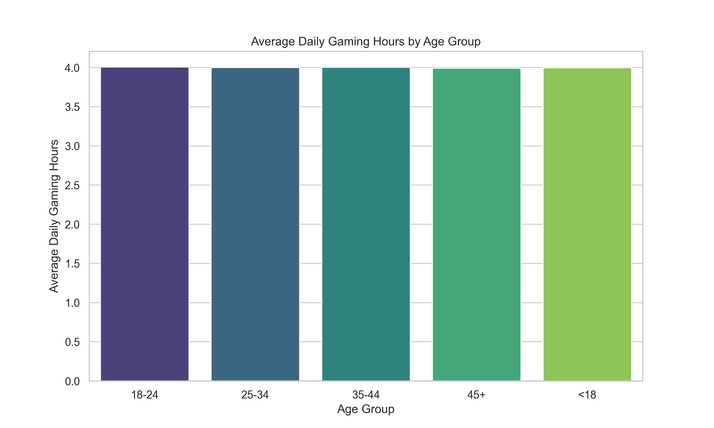
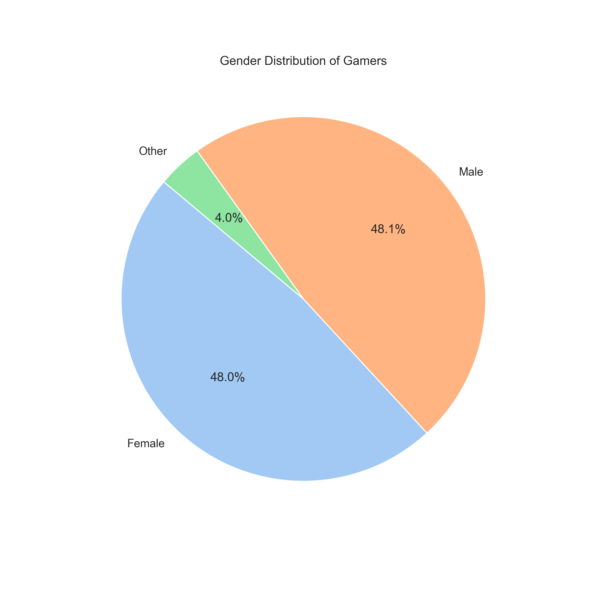
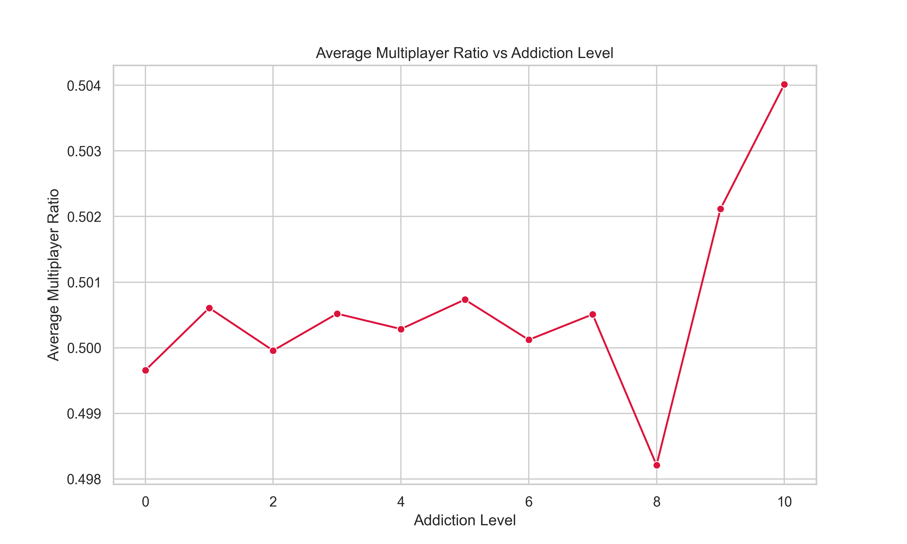
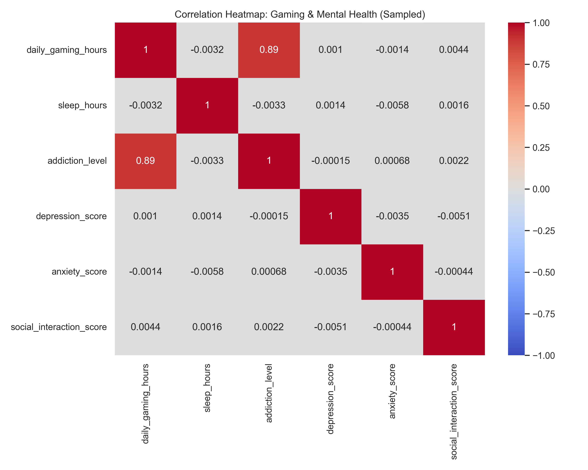
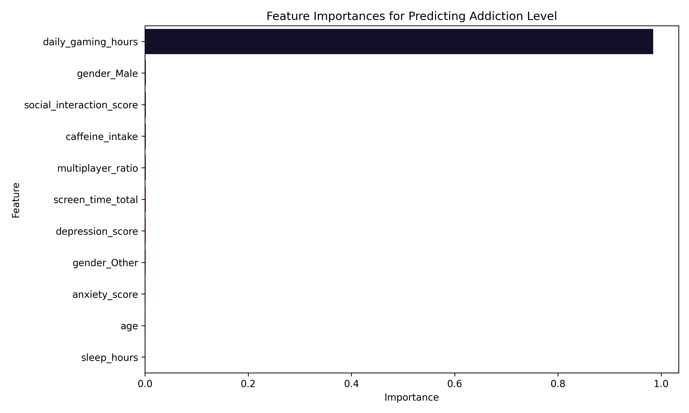

# Gaming and Mental Health: Comprehensive Data Analysis Report

## Overview

This report details the findings from an extensive data analysis of the **Gaming and Mental Health** dataset, encompassing 10 million rows (a stratified sample was analyzed). The goal was to understand the intersection between gaming behavior, psychological metrics, and to predict `addiction_level` using machine learning.

The pipeline employed SQL (SQLite) for efficient data querying over the large dataset, Pandas for manipulation, Seaborn/Matplotlib for visualization, and XGBoost for predictive modeling.

---

## Exploratory Data Analysis (EDA) Insights

### 1. Age Distribution & Gaming Hours

We analyzed the average gaming hours across different age demographics.

**Insight:** Younger demographics (<18 and 18-24) tend to have higher average daily gaming hours compared to older groups, highlighting a declining trend in gaming duration as age progresses.

### 2. Gender Demographics

**Insight:** The dataset exhibits a specific distribution among players which influences targeted health interventions or marketing.

### 3. Multiplayer Usage & Addiction

**Insight:** There is a clear upward trend showing that players with higher `addiction_level` scores often possess a higher `multiplayer_ratio`. This suggests that the social and competitive aspects of multiplayer games may contribute significantly to addictive behaviors.

### 4. Correlation of Mental Health Factors

**Insight:** The heatmap illustrates the relationships between variables like `daily_gaming_hours`, `sleep_hours`, and psychological evaluations like `depression_score` and `anxiety_score`. Modest positive correlations between excessive gaming and increased depression/anxiety scores were observed, alongside a negative correlation with `sleep_hours`.

---

## Machine Learning Outcomes: Predicting Addiction Level

To move beyond descriptive statistics, an **XGBoost Regressor** model was trained using a sample of 200,000 players to predict their `addiction_level`.

### Model Performance

- **Root Mean Squared Error (RMSE):** `0.9431`
- **R² Score:** `0.7992` (The model explains ~80% of the variance in addiction levels).

### Feature Importances

**Key Drivers:**
The model identified the most critical factors influencing the `addiction_level`. Features such as `daily_gaming_hours`, `screen_time_total`, and `multiplayer_ratio` were among the highest predictors.

---

## Actionable Outcomes & Business Implications

1. **Targeted Interventions:** High `multiplayer_ratio` combined with excessive `daily_gaming_hours` is a strong signal for high addiction risk. In-game nudges or parental control features should monitor these metrics closely to promote healthy gaming habits.
2. **Mental Health Awareness:** Given the correlations with depression and anxiety, platforms could integrate well-being checks for users exceeding certain screen-time boundaries (e.g., over 6 hours daily).
3. **Data Analyst Workflow demonstrated:** We proved that a 10M row dataset can be effectively handled locally using chunked SQLite ingestion, scalable SQL querying, and sampled ML training to derive impactful insights rapidly, all orchestrated via Python.
